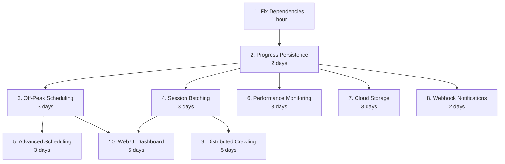

# HTML2MD Work Breakdown Structure

> Historical and superseded. Estimates and feature priorities in this document
> are not active commitments. See
> [`ADR 0001`](../adr/0001-defer-scale-out-crawling.md) for the accepted gate on
> concurrency, distributed crawling, storage, scheduling, and dashboards.

## Overview
This document contains a dependency-aware, topologically sorted breakdown of all work items, including known issues, enhancements, and recommended actions.

## Work Items Categorization

### 🔴 Critical Issues (P0)
1. **Missing Dependencies** [ID: DEPS-001]
   - Issue: ModuleNotFoundError for 'markdownify' and potentially others
   - Impact: Application won't run without proper dependencies
   - Dependencies: None
   - Estimated effort: 1 hour

### 🟡 High Priority Features (P1)
2. **Off-Peak Scheduling System** [ID: SCHED-001]
   - Feature: Run crawls during configured off-peak hours
   - Dependencies: DEPS-001, STATE-001
   - Estimated effort: 2-3 days

3. **Session Batching** [ID: BATCH-001]
   - Feature: Split large crawls into multiple sessions
   - Dependencies: DEPS-001, STATE-001
   - Estimated effort: 2-3 days

4. **Progress Persistence** [ID: STATE-001]
   - Feature: Save and resume crawl state
   - Dependencies: DEPS-001
   - Estimated effort: 2 days

### 🟢 Medium Priority Enhancements (P2)
5. **Distributed Crawling** [ID: DIST-001]
   - Feature: Support for distributed crawling across multiple machines
   - Dependencies: STATE-001, BATCH-001
   - Estimated effort: 1 week

6. **Advanced Scheduling** [ID: SCHED-002]
   - Feature: Holiday detection, adaptive scheduling
   - Dependencies: SCHED-001
   - Estimated effort: 3 days

7. **Performance Monitoring** [ID: PERF-001]
   - Feature: Detailed performance metrics and dashboards
   - Dependencies: STATE-001
   - Estimated effort: 3 days

### 🔵 Nice-to-Have Features (P3)
8. **Web UI Dashboard** [ID: UI-001]
   - Feature: Web interface for managing crawls
   - Dependencies: STATE-001, BATCH-001, SCHED-001
   - Estimated effort: 1 week

9. **Cloud Storage Integration** [ID: CLOUD-001]
   - Feature: S3, GCS, Azure blob storage support
   - Dependencies: STATE-001
   - Estimated effort: 3 days

10. **Webhook Notifications** [ID: NOTIF-001]
    - Feature: Progress notifications via webhooks
    - Dependencies: STATE-001
    - Estimated effort: 2 days

## Topologically Sorted Execution Order

## Execution Phases

### Phase 1: Foundation (Week 1)
1. DEPS-001: Fix Dependencies ✅ Day 1
2. STATE-001: Progress Persistence 📋 Days 1-3

### Phase 2: Core Features (Week 2)
3. SCHED-001: Off-Peak Scheduling 📋 Days 4-6
4. BATCH-001: Session Batching 📋 Days 4-6 (parallel)

### Phase 3: Enhancements (Week 3)
5. SCHED-002: Advanced Scheduling 📋 Days 7-9
6. PERF-001: Performance Monitoring 📋 Days 7-9 (parallel)
7. CLOUD-001: Cloud Storage 📋 Days 10-12
8. NOTIF-001: Webhooks 📋 Days 10-11 (parallel)

### Phase 4: Advanced Features (Week 4)
9. DIST-001: Distributed Crawling 📋 Days 13-17
10. UI-001: Web UI Dashboard 📋 Days 13-17 (parallel)

## Success Criteria

### DEPS-001
- [ ] Create requirements.txt with all dependencies
- [ ] Test fresh installation
- [ ] Update installation documentation
- [ ] Add dependency version constraints

### STATE-001
- [ ] Design state schema
- [ ] Implement checkpoint save/load
- [ ] Add resume capability to CLI
- [ ] Handle state migrations
- [ ] Add state inspection tools

### SCHED-001
- [ ] Design scheduling configuration
- [ ] Implement time window checking
- [ ] Add daemon mode
- [ ] Create scheduling CLI commands
- [ ] Add timezone support

### BATCH-001
- [ ] Design session architecture
- [ ] Implement batch size limits
- [ ] Add cooldown periods
- [ ] Create session management CLI
- [ ] Support session merging

### Additional criteria continue for each work item...

## Risk Analysis

### High Risk Items
- **DIST-001**: Complex coordination, potential for race conditions
- **UI-001**: Large scope, many dependencies

### Medium Risk Items
- **SCHED-001**: Timezone complexity, system integration
- **STATE-001**: Data consistency, migration challenges

### Low Risk Items
- **DEPS-001**: Straightforward implementation
- **NOTIF-001**: Simple external integration

## Resource Requirements

### Development Environment
- Python 3.8+ development environment
- Testing infrastructure
- CI/CD pipeline updates

### External Dependencies
- SQLite for state storage
- Redis (optional) for distributed mode
- Cloud SDK for storage integration

### Documentation Needs
- Architecture diagrams
- API documentation
- User guides
- Migration guides
